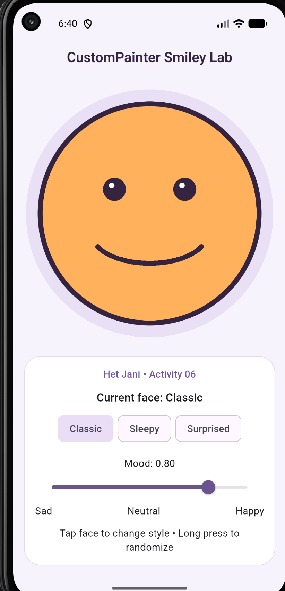
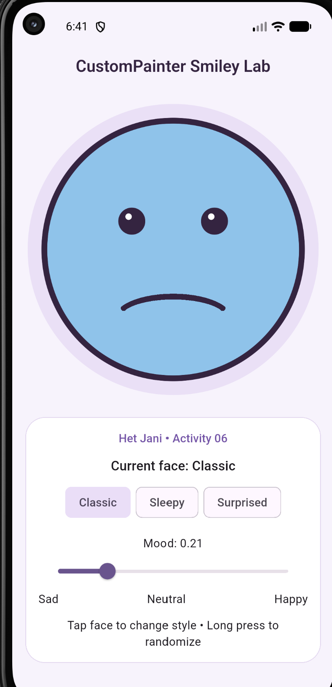
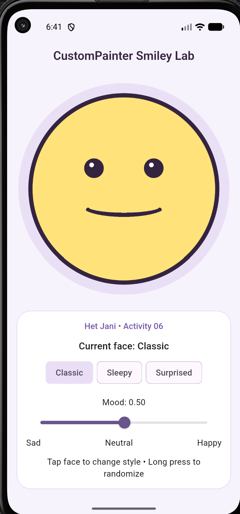
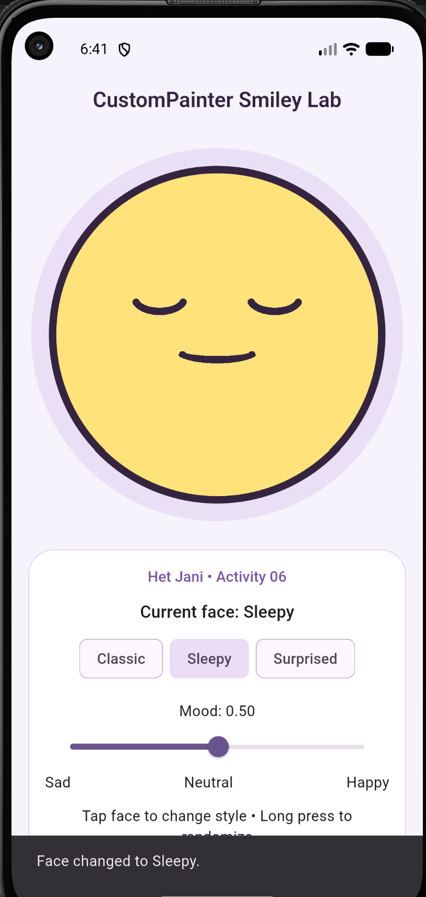
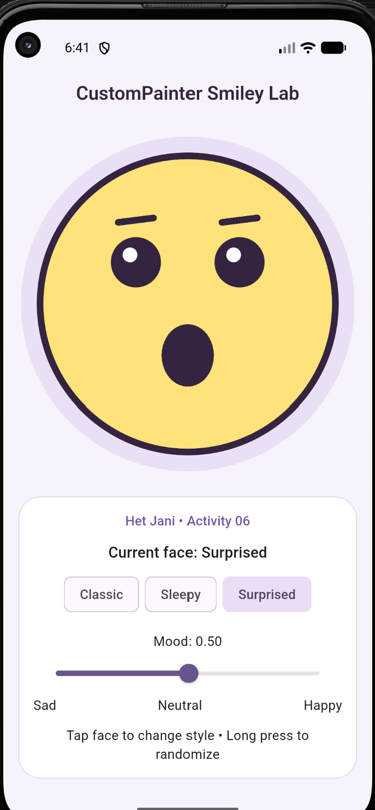
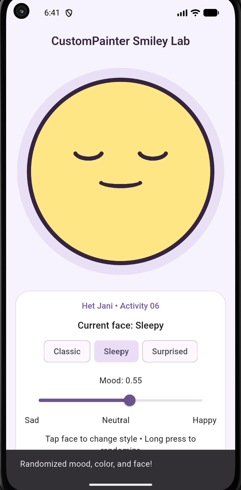
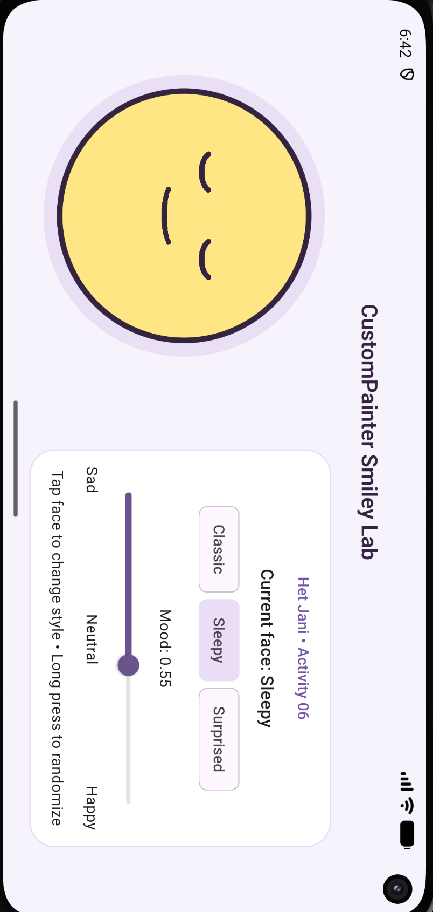

# Activity 06 Critical Thinking

Student: Het Jani

My face is drawn around `Offset(size.width / 2, size.height / 2)`. Its radius is `size.shortestSide * 0.4`, so the shorter canvas dimension controls its size. I calculate the mouth rectangle's width, height, and position as fractions of that radius. This keeps the mouth proportional to the face when the available space changes. The classic mouth uses `drawArc()` with angles in radians; I use a lower arc for a smile and an upper arc for a frown.

Moving the slider calls `setState()` and passes the new mood and color to the painter. `shouldRepaint()` compares mood, face color, and face type with the previous painter. It returns true when any of these inputs changes and false when they are all unchanged.

## Orientation evidence

Automated checks passed in portrait and landscape on the Pixel 4a Android emulator. They exercised the face buttons, slider, tap, and long press, and checked for layout errors. Local widget tests also passed at 393 × 851, 851 × 393, 320 × 568, and 568 × 320 logical pixels.

The screenshots below show the face above the controls in portrait and beside the controls in landscape. The circular face stays fully visible, and its eyes and mouth remain proportional as the drawing area changes.

## Screenshot evidence

These seven emulator screenshots were supplied on September 29, 2026. The image files are preserved as supplied.

### 1. Classic happy face — mood 0.80

The warm orange face has symmetrical round eyes and a large smile drawn with an arc. The mood value and slider are visible below it.

### 2. Classic sad face — mood 0.21

Moving the mood below 0.35 changes the face to cool blue and changes the mouth to a frown.

### 3. Classic neutral face — mood 0.50

The middle mood band uses a yellow face and a soft, shallow smile.

### 4. Tap interaction and Sleepy face

The Sleepy design uses closed curved eyes and a smaller mouth. The visible SnackBar, “Face changed to Sleepy.”, confirms the tap action changed the face style.

### 5. Surprised face

The selected Surprised button matches the current face label. Larger eyes, raised eyebrows, and an open oval mouth make this design visibly different from Classic and Sleepy.

### 6. Long-press randomization

The SnackBar reads “Randomized mood, color, and face!” after a long press. This result shows a Sleepy face at mood 0.55, with a yellow color that remains within the required middle mood band.

### 7. Landscape layout

The landscape layout places the drawing and controls beside each other. The complete face remains visible, with proportional eyes and mouth. The supplied image is stored sideways; viewed upright, the face is on the left and the controls are on the right.

